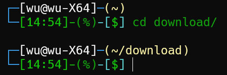

## 查看所有进程

```
ps -aux
```

## 查看某个进程使用的端口

```
netstat -tunlp
```

## 查看某个端口使用情况

```
lsof -i:端口号
```

## 重启网络

service network restart

## 搜索

```
locate	数据库中搜所有文件
which	搜索PATH目录下的文件。但是名字要输全，不然找不到
whereis	数据库中搜PATH目录下的文件，适合用于找安装的软件
```

## 解压

unzip xx.zip

unzip xx.zip -d dir		解压dir文件夹

tar zxvf

## 屏幕共享

### x11vnc

```
systemctl start x11vnc
systemctl stop x11vnc
```

## 后台运行指令

### nohup

```
nohup python test.py >output1.log 2>&1 &		#>output1.log将输出重定向到output1.log，2>&1将错误输出流合并到标准输出流。&为nohup参数，表示后台运行程序
jobs -l			列出后台运行的程序。重进终端后无效
fg	%id			将后台运行的程序恢复
c-z				前台程序放入后台
```

### screen

```
screen vim test.txt
screen -S name ...	以name为名字运行命令
screen -ls		列出
screen -r name	打开
screen -d name
<c-a>d			screen内detach这个screen
```


## 重定向

```
command < file		#重定向输入流
command > file 		#重定向输出流
command >> file		#重定向输出流并以追加的形式输出
n>&m			   #将文件描述符n和m的输出合并
n<&m			   #将文件描述符n和m的输入合并
文件描述符：0表示标准输入，1表示标准输出，2表示错误输出
```

### 重定向舍弃输出

```
command > /dev/null
```

## 服务

服务可自行配置

/etc/systemd/system	供管理员使用。自定义的一般放这
/lib/systemd/system	 供软件包使用

### 控制命令

```
systemctl start servicename		开启
systemctl stop servicename		关闭
systemctl restart servicename	重启
systemctl status servicename	查看状态
journalctl -u servicename		查看日志
```

### 编写服务


## 添加环境变量

```
export PATH=/root/.local/bin:$PATH
```

## 查看磁盘使用情况

```
df
df -BM			以M为单位显示磁盘使用情况
df -BG			以G为单位显示磁盘使用情况
```

# 第三方插件

## htop

## ranger

```
大部分命令类似vim
hjkl移动
/搜索
<s-s>	退出ranger并进入ranger显示的文件夹
```


## sakurafrpc

```
systemctl start frpc@wdnmdtoken666666:12345		开启访问密钥为 wdnmdtoken666666 的用户所拥有的 ID 为 12345 的隧道:
```

## ssr

alias ssr=shadowsocksr-cli

```
ssr -l										列出所有节点
ssr -s (id)									启用某个节点
ssr -S										停用ssr
export ALL_PROXY=socks5://127.0.0.1:1080		设置代理。只在当前终端有效
curl http://ip-api.com/json/?lang=zh-CN 		检查网络是否开启ssr

```

## w-get

下载磁力链接

## oms

ohmysh

### theme

rjorgenson


90210


garo


agnoster


hawaii50


tonotdo


axin


primer


sexy


kitsune



wanelo


emperor


nwinkler_random_colors


cupcake


bobby


mbriggs


# 小知识

## 目录

### /usr/bin和/usr/local/bin

usr指unix system resource

/usr/bin放的是系统预安装的可执行文件，随系统变化
/usr/local/bin放用户自己安装的可执行文件
